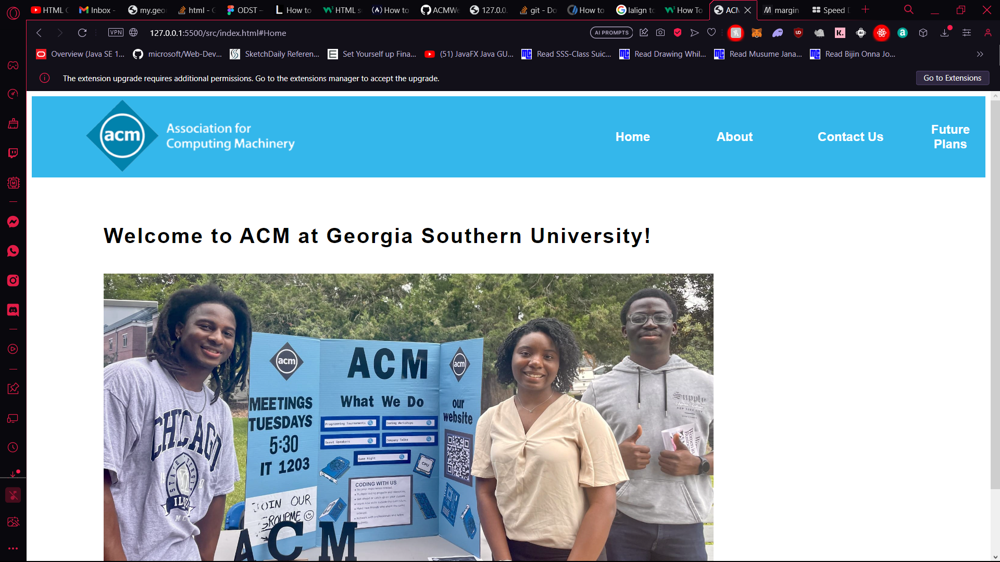
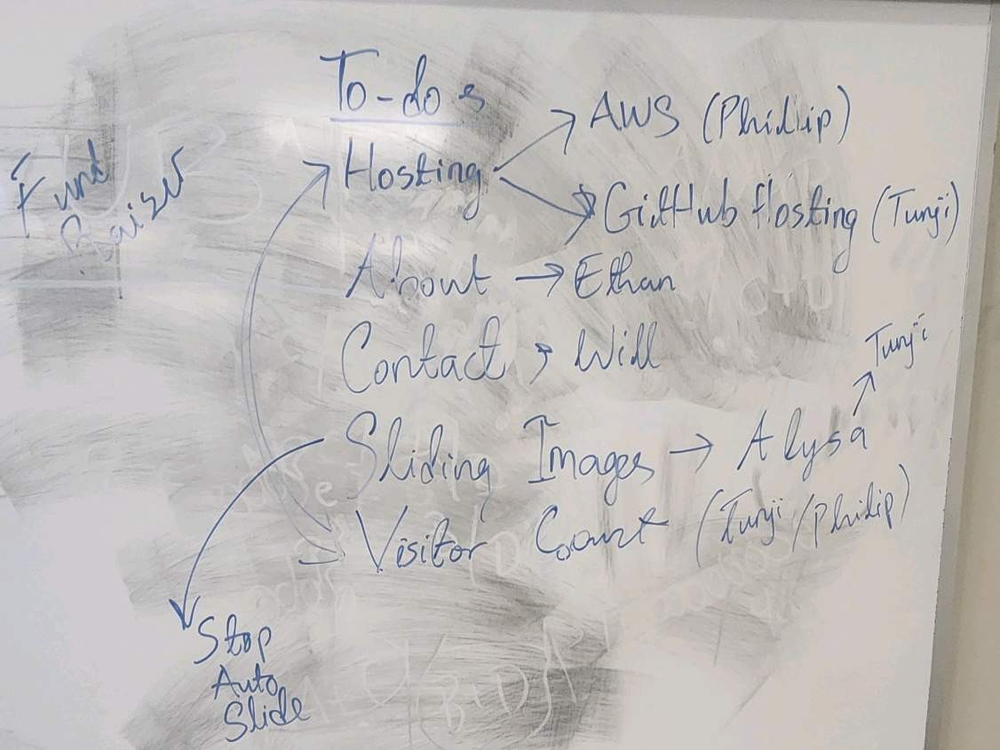
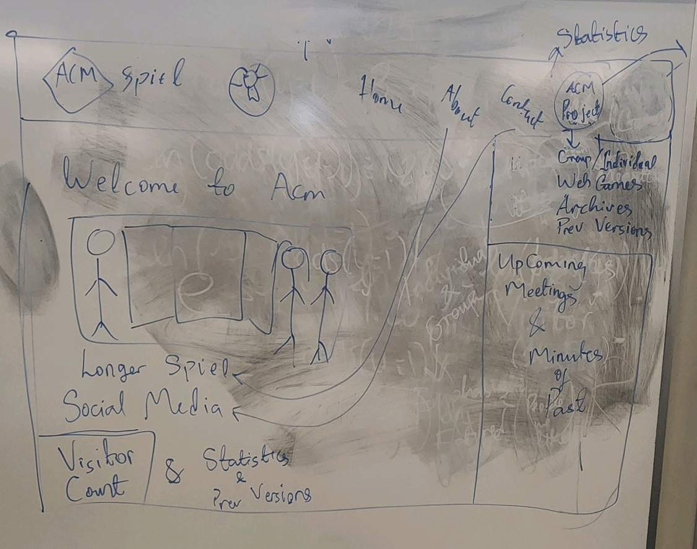
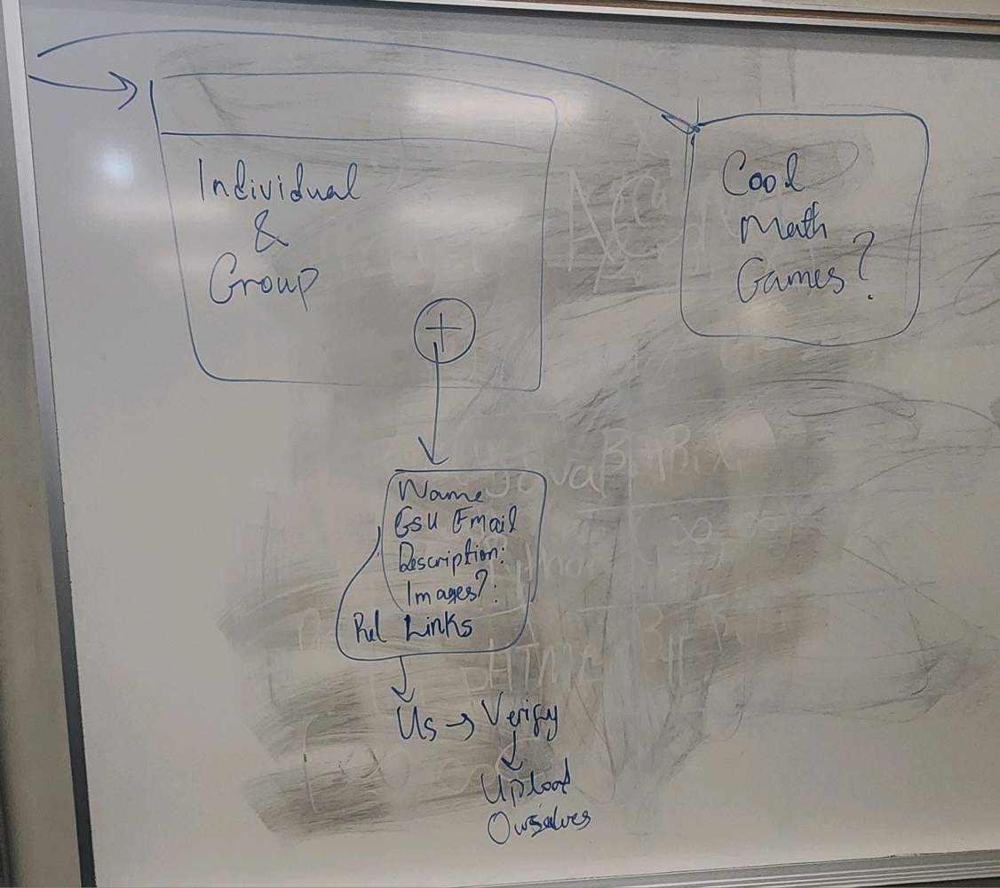

# ACMWebsite
Information page about the Georgia Southern Chapter of ACM.

Made collaboratively by the members of the club in HTML, CSS & Javascript.

## Note For Developers

Any changes made by a non-officer must be done in a separate branch and reviewed before merging into the main branch.

Naming Convention for Branches: Just keep it short but related to what you're working on.  
If you're working on the about section, name your branch "About", if Sliding Images, name it "slideImgs" or something like that. Short but descriptive.

The site is up at https://acmgsu.com/  

Check out the discord for other best practices under the website details channel. <a href = https://discord.com/channels/753431647482806302/1150976318658330705>Link</a>

## Urgent To-Dos and Assignments (Team Leads)
* Hosting (Done) 
* About (Ethan) 
* Contacts (Will)
* Sliding Images (Alysa) -> (Tunji to provide images)
* Visitor Count (Tunji / Count)

### Anyone who wants to work under an existing group (Contact those whose names are listed)

## Current State of the main branch:

## Current Plans

As you can see, we're just starting out . We'll see where this goes!

