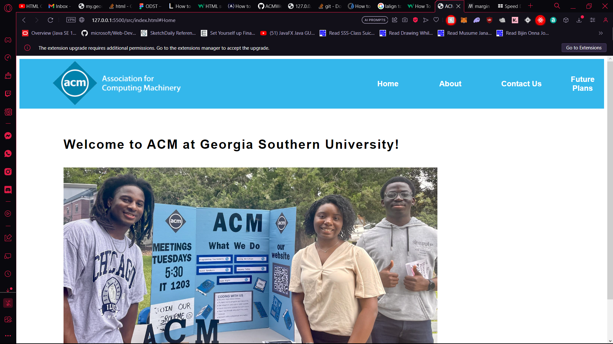

# ACMWebsite
Information page about the Georgia Southern Chapter of ACM.

Made collaboratively by the members of the club in HTML, CSS & Javascript.

## Note For Developers

Any changes made by a non-officer must be done in a separate branch and reviewed before merging into the main branch.

## Current State of the main branch:

As you can see, we're just starting out .We'll see where this goes!