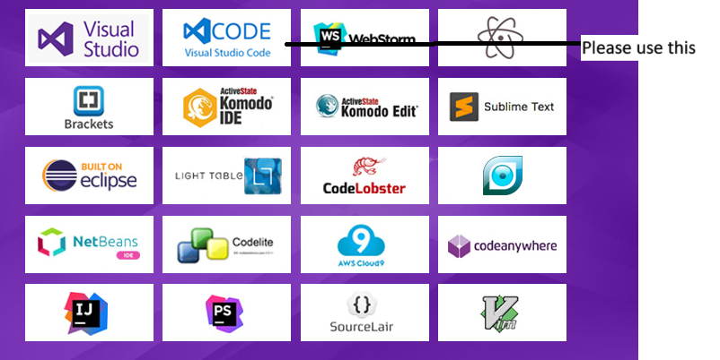

# Start Up for Development

## Prerequisites
* An Integrated Development Environment (IDE) (Visual Studio Code is recommended)
* Github Account, Github Desktop and Git installed (Please follow an online tutorial for this)

## Buzzwords
* IDE - Integrated Development Environment (Basically like your eclipses that you can use to write code).
* Git - Version Control System (VCS) that we will use to manage our code.
* Github - A website that hosts git repositories. (Think of it as a cloud storage for code)
* Github Desktop - A GUI for git that makes it easier to use.
* Repository - A folder that contains all the code for a project.
* Clone - Downloading a repository from github to your local machine to then work on.
* Branch - A copy of the code that is separate from the main code base. (Think of it as a copy of the code that you can make changes to without affecting the main code base)
* Commit - Saving your changes to your branch.
* Push - Publishing your branch to github, so that it is publicly available to anyone that wants to work with you.
* Pull Request - A request to merge your branch into the main code base.
* Merge - Combining your branch with the main code base to implement your changes into the working code.
* Sync - Downloading the latest code from github to your local machine.

## Process

1. Download and setup your IDE. (Lots of tutorials on how to do this online) 
2. Clone the repository to your local machine. 
3. Open the repository in your IDE.
4. Before you make any changes, create a new branch, and name it appropriately. (This is a way to keep your changes separate from the main code base)
5. After significant changes, commit your changes to your branch, and push/publish your branch to github. (Make sure to write a good commit message that describes what you changed, and do it often)
6. When you are ready to merge your changes into the main code base, create a pull request on github.
7. After your pull request is approved, merge your branch into the main code base.
8. Delete your branch.
9. When continuing work on a branch, make sure to sync up before starting again to make sure you have the latest code from your branch, in case anyone else was working on it.

## Tips
* DO NOT MAKE ANY COMMITS TO THE MAIN BRANCH (master). This is the main code base that our website feeds off, and should only be changed through pull requests or by officers.
* **Each new major feature being implemented must be done on a separate branch**. (This is to make sure we know what changes are being made, and to make sure we don't break anything)
* *The site is being hosted on AWS, if you want to publish your changes to a dummy site, you will need to contact an officer to get access to the AWS account.*
* To actually see your changes, you can either save your changes and open your file directly in the browser, or use a live server extension in your IDE. 

